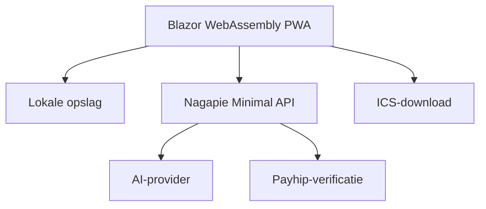
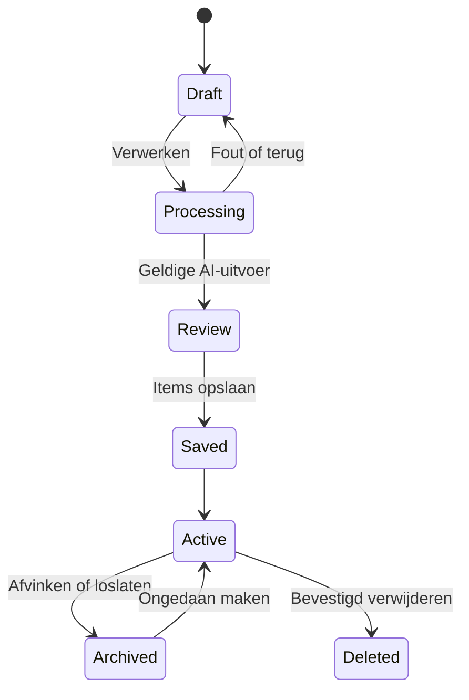

# Nagapie Braindump Lite — technische MVP-specificatie

**Documentversie:** 1.0  
**Datum:** 16 september 2026  
**Doel:** bouwklare technische blauwdruk voor de eerste testbare versie  
**Stack:** C# / .NET 10 / Blazor WebAssembly PWA / ASP.NET Core Minimal API

## 1. Technische hoofdkeuzes

Deze keuzes staan voor de MVP vast:

| Onderdeel | Keuze |
|---|---|
| Front-end | Blazor WebAssembly Progressive Web App |
| Interactiviteit | Volledig client-side; geen Interactive Server en geen SignalR-afhankelijkheid |
| Backend | Kleine stateless ASP.NET Core Minimal API |
| Framework | .NET 10 LTS |
| UI | Razor-componenten met scoped CSS |
| Opslag | Browser `localStorage`, achter een verwisselbare C#-interface |
| Database | Geen gebruikersdatabase in de MVP |
| Account | Geen account of login |
| AI | Externe AI-provider via de eigen beveiligde API |
| AI-functie | Verplicht onderdeel van de normale flow: splitsen, categoriseren en tijdvak voorstellen |
| Invoer | Tekst en, waar ondersteund, browser-spraakherkenning |
| Talen | Nederlands en Engels via `.resx` |
| Agenda | Lokaal gegenereerd `.ics`-bestand |
| Betaling | Eerste drie verwerkte dumps gratis; daarna eenmalig €4,99 via Payhip |
| Testfase | Paywall volledig uit via configuratie |
| Pushnotificaties | Niet in de MVP |
| Gegevensmelding | Alleen waarschuwingen rond wissen of mogelijk verlies van gegevens |
| Latere native app | .NET MAUI Blazor Hybrid met SQLite als mogelijke vervolgstap |

### Waarom twee projecten nodig zijn

Blazor WebAssembly draait in de browser. Alles wat daarin staat, kan technisch door een gebruiker worden bekeken. Daarom mogen een AI-API-key en het Payhip-productsecret nooit in het clientproject staan.

De oplossing bestaat dus uit:

1. een statische Blazor WebAssembly PWA voor de gebruikersinterface en lokale gegevens;
2. een kleine API voor AI-verwerking en licentiecontrole;
3. een gedeeld project met uitsluitend request- en responsecontracten.

Er is geen server-side gebruikerssessie en geen database met braindump-inhoud.

## 2. Architectuuroverzicht



### Gegevensstromen

| Gegeven | Waar verwerkt? | Waar bewaard? |
|---|---|---|
| Ruwe tekst-draft | Browser | Tijdelijk in `localStorage` |
| Ruwe dump tijdens AI-call | Nagapie API en AI-provider | Niet in Nagapie-database of logs |
| Gesplitste items | Browser | `localStorage` |
| Categorieën en tijdvakken | Browser | `localStorage` |
| Audio | Browser/apparaatleverancier | Niet door Nagapie opgeslagen |
| AI-toestemming | Browser | `localStorage` |
| Gratis-dump-teller | Browser | `localStorage` |
| Payhip-licentiesleutel | Alleen tijdens verificatie | Niet als platte sleutel bewaren |
| Ondertekend unlocktoken | Browser | `localStorage` |
| Supportmail | E-mailprovider | Volgens privacyverklaring |

## 3. Functionele kernflow

De app houdt maximaal drie zichtbare stappen:

1. **Dump it** — één volledige braindump typen of inspreken.
2. **Sort it** — AI splitst de dump en stelt per item categorie en tijdvak voor; gebruiker controleert.
3. **Clear it** — items afvinken, loslaten, bewerken of naar agenda exporteren.



## 4. Solution aanmaken

### Benodigd op de ontwikkelmachine

- .NET 10 SDK;
- Visual Studio met ondersteuning voor .NET 10, of VS Code met C# Dev Kit;
- Git;
- moderne browser met ontwikkelaarstools;
- later: accounts en secrets voor de gekozen AI-provider en Payhip.

Controle:

```bash
dotnet --version
git --version
```

### CLI-commando’s

```bash
mkdir Nagapie.BraindumpLite
cd Nagapie.BraindumpLite

dotnet new sln -n Nagapie.BraindumpLite --format sln

dotnet new blazorwasm \
  -n Nagapie.BraindumpLite.Client \
  -o src/Nagapie.BraindumpLite.Client \
  --pwa

dotnet new webapi \
  -n Nagapie.BraindumpLite.Api \
  -o src/Nagapie.BraindumpLite.Api

dotnet new classlib \
  -n Nagapie.BraindumpLite.Contracts \
  -o src/Nagapie.BraindumpLite.Contracts

dotnet new xunit \
  -n Nagapie.BraindumpLite.Client.Tests \
  -o tests/Nagapie.BraindumpLite.Client.Tests

dotnet new xunit \
  -n Nagapie.BraindumpLite.Api.Tests \
  -o tests/Nagapie.BraindumpLite.Api.Tests

dotnet sln add src/Nagapie.BraindumpLite.Client
dotnet sln add src/Nagapie.BraindumpLite.Api
dotnet sln add src/Nagapie.BraindumpLite.Contracts
dotnet sln add tests/Nagapie.BraindumpLite.Client.Tests
dotnet sln add tests/Nagapie.BraindumpLite.Api.Tests

dotnet add src/Nagapie.BraindumpLite.Client reference \
  src/Nagapie.BraindumpLite.Contracts

dotnet add src/Nagapie.BraindumpLite.Api reference \
  src/Nagapie.BraindumpLite.Contracts

dotnet add tests/Nagapie.BraindumpLite.Client.Tests reference \
  src/Nagapie.BraindumpLite.Client

dotnet add tests/Nagapie.BraindumpLite.Api.Tests reference \
  src/Nagapie.BraindumpLite.Api
```

Voeg daarna een `.gitignore` voor Visual Studio/.NET toe en commit eerst alleen de lege solution.

## 5. Definitieve mapstructuur

```text
Nagapie.BraindumpLite/
├── .editorconfig
├── .gitignore
├── Directory.Build.props
├── Directory.Packages.props
├── Nagapie.BraindumpLite.sln
├── README.md
│
├── docs/
│   ├── architecture.md
│   ├── privacy-data-flow.md
│   ├── ai-prompt.md
│   └── test-scenarios.md
│
├── src/
│   ├── Nagapie.BraindumpLite.Client/
│   │   ├── Components/
│   │   │   ├── Layout/
│   │   │   │   ├── MainLayout.razor
│   │   │   │   ├── MainLayout.razor.css
│   │   │   │   ├── AppHeader.razor
│   │   │   │   └── BottomNavigation.razor
│   │   │   ├── BrainDump/
│   │   │   │   ├── BrainDumpInput.razor
│   │   │   │   ├── SpeechInputButton.razor
│   │   │   │   ├── ProcessingState.razor
│   │   │   │   ├── SplitReviewList.razor
│   │   │   │   ├── SplitReviewItem.razor
│   │   │   │   ├── BrainDumpList.razor
│   │   │   │   ├── BrainDumpListItem.razor
│   │   │   │   ├── BrainDumpEditDialog.razor
│   │   │   │   ├── CategoryPicker.razor
│   │   │   │   ├── CategoryEditDialog.razor
│   │   │   │   └── CalendarExportDialog.razor
│   │   │   └── Shared/
│   │   │       ├── AppButton.razor
│   │   │       ├── AppDialog.razor
│   │   │       ├── AppToast.razor
│   │   │       ├── ConfirmDeleteDialog.razor
│   │   │       ├── DataLossNotice.razor
│   │   │       ├── AiConsentDialog.razor
│   │   │       ├── AccessGate.razor
│   │   │       ├── EmptyState.razor
│   │   │       ├── InlineError.razor
│   │   │       └── StepIndicator.razor
│   │   ├── Pages/
│   │   │   ├── Welcome.razor
│   │   │   ├── Home.razor
│   │   │   ├── Review.razor
│   │   │   ├── MyList.razor
│   │   │   ├── Unlock.razor
│   │   │   ├── Settings.razor
│   │   │   ├── Privacy.razor
│   │   │   ├── Terms.razor
│   │   │   └── NotFound.razor
│   │   ├── Domain/
│   │   │   ├── BrainDumpItem.cs
│   │   │   ├── Category.cs
│   │   │   ├── AppSettings.cs
│   │   │   ├── AccessState.cs
│   │   │   ├── ReviewSession.cs
│   │   │   └── Enums/
│   │   │       ├── InputMethod.cs
│   │   │       ├── CompletionReason.cs
│   │   │       └── PlanningHorizon.cs
│   │   ├── Services/
│   │   │   ├── Interfaces/
│   │   │   │   ├── IBrainDumpRepository.cs
│   │   │   │   ├── ICategoryRepository.cs
│   │   │   │   ├── ISettingsRepository.cs
│   │   │   │   ├── IAccessRepository.cs
│   │   │   │   ├── ILocalStorageService.cs
│   │   │   │   ├── IBrainDumpProcessingClient.cs
│   │   │   │   ├── ILicenseClient.cs
│   │   │   │   ├── ISpeechInputService.cs
│   │   │   │   └── ICalendarExportService.cs
│   │   │   ├── BrainDumpRepository.cs
│   │   │   ├── CategoryRepository.cs
│   │   │   ├── SettingsRepository.cs
│   │   │   ├── AccessRepository.cs
│   │   │   ├── LocalStorageService.cs
│   │   │   ├── BrainDumpProcessingClient.cs
│   │   │   ├── LicenseClient.cs
│   │   │   ├── SpeechInputService.cs
│   │   │   └── CalendarExportService.cs
│   │   ├── State/
│   │   │   ├── AppState.cs
│   │   │   └── DraftState.cs
│   │   ├── Validation/
│   │   │   ├── BrainDumpInputValidator.cs
│   │   │   ├── ReviewItemValidator.cs
│   │   │   └── CategoryValidator.cs
│   │   ├── Constants/
│   │   │   ├── StorageKeys.cs
│   │   │   ├── CategoryKeys.cs
│   │   │   └── AppLimits.cs
│   │   ├── Resources/
│   │   │   ├── AppResources.resx
│   │   │   └── AppResources.nl.resx
│   │   ├── wwwroot/
│   │   │   ├── css/
│   │   │   │   ├── tokens.css
│   │   │   │   ├── base.css
│   │   │   │   ├── components.css
│   │   │   │   └── app.css
│   │   │   ├── js/
│   │   │   │   ├── localStorage.js
│   │   │   │   ├── speechRecognition.js
│   │   │   │   └── fileDownload.js
│   │   │   ├── icons/
│   │   │   ├── appsettings.json
│   │   │   ├── index.html
│   │   │   ├── manifest.webmanifest
│   │   │   └── service-worker.published.js
│   │   ├── App.razor
│   │   ├── Program.cs
│   │   └── _Imports.razor
│   │
│   ├── Nagapie.BraindumpLite.Contracts/
│   │   ├── Dumps/
│   │   │   ├── ProcessDumpRequest.cs
│   │   │   ├── ProcessDumpResponse.cs
│   │   │   └── SplitItemDto.cs
│   │   ├── Licensing/
│   │   │   ├── VerifyLicenseRequest.cs
│   │   │   └── VerifyLicenseResponse.cs
│   │   └── Common/
│   │       ├── ApiError.cs
│   │       └── CategoryReferenceDto.cs
│   │
│   └── Nagapie.BraindumpLite.Api/
│       ├── Endpoints/
│       │   ├── ProcessDumpEndpoint.cs
│       │   ├── VerifyLicenseEndpoint.cs
│       │   └── HealthEndpoint.cs
│       ├── Ai/
│       │   ├── IAiBrainDumpProcessor.cs
│       │   ├── AiBrainDumpProcessor.cs
│       │   ├── AiPromptFactory.cs
│       │   ├── AiResultValidator.cs
│       │   └── Models/AiSplitResult.cs
│       ├── Licensing/
│       │   ├── IPayhipLicenseVerifier.cs
│       │   ├── PayhipLicenseVerifier.cs
│       │   ├── IUnlockTokenService.cs
│       │   └── UnlockTokenService.cs
│       ├── Middleware/
│       │   ├── CorrelationIdMiddleware.cs
│       │   ├── SafeExceptionMiddleware.cs
│       │   └── ContentSafeLoggingMiddleware.cs
│       ├── Options/
│       │   ├── AiProviderOptions.cs
│       │   ├── PayhipOptions.cs
│       │   └── AccessOptions.cs
│       ├── Validation/
│       │   ├── ProcessDumpRequestValidator.cs
│       │   └── VerifyLicenseRequestValidator.cs
│       ├── appsettings.json
│       ├── appsettings.Development.json
│       └── Program.cs
│
└── tests/
    ├── Nagapie.BraindumpLite.Client.Tests/
    │   ├── Repositories/
    │   ├── Services/
    │   ├── Components/
    │   └── Localization/
    └── Nagapie.BraindumpLite.Api.Tests/
        ├── Endpoints/
        ├── Ai/
        ├── Licensing/
        └── Security/
```

## 6. Centrale projectinstellingen

### `Directory.Build.props`

```xml
<Project>
  <PropertyGroup>
    <TargetFramework>net10.0</TargetFramework>
    <Nullable>enable</Nullable>
    <ImplicitUsings>enable</ImplicitUsings>
    <TreatWarningsAsErrors>true</TreatWarningsAsErrors>
    <AnalysisLevel>latest</AnalysisLevel>
    <InvariantGlobalization>false</InvariantGlobalization>
  </PropertyGroup>
</Project>
```

Gebruik centraal packagebeheer met `Directory.Packages.props`. Pin concrete versies bij de start van de bouw en update bewust, niet automatisch midden in een testfase.

### Minimale packages

**Client**

- `Microsoft.AspNetCore.Components.WebAssembly`;
- `Microsoft.AspNetCore.Components.WebAssembly.DevServer` alleen voor development;
- `Microsoft.Extensions.Localization`;
- `Microsoft.Extensions.Http` voor typed clients.

**API**

- officiële SDK of gewone `HttpClient` voor de gekozen AI-provider;
- `Microsoft.AspNetCore.OpenApi` alleen in development;
- ingebouwde ASP.NET Core rate limiting;
- ingebouwde `System.Text.Json`-serialisatie.

**Tests**

- xUnit;
- `Microsoft.NET.Test.Sdk`;
- bUnit voor Razor-componenttests;
- eventueel een mockingbibliotheek, maar houd de eerste tests zo veel mogelijk met kleine fakes.

Voeg geen database-ORM, authenticationframework, state-managementframework of uitgebreide componentlibrary toe voor deze MVP.

## 7. Configuratie

### Client `wwwroot/appsettings.json`

Clientconfiguratie is openbaar en bevat nooit secrets.

```json
{
  "Api": {
    "BaseUrl": "/"
  },
  "Access": {
    "PaywallEnabled": false,
    "FreeDumpLimit": 3,
    "PriceDisplay": "€ 4,99",
    "PayhipProductUrl": "https://payhip.com/b/[PRODUCT]"
  },
  "App": {
    "Version": "0.1.0-test",
    "EnvironmentLabel": "Test",
    "SupportEmail": "hello@nagapie.nl"
  }
}
```

### API-configuratie

Niet-geheime defaults mogen in `appsettings.json`:

```json
{
  "Access": {
    "PaywallEnabled": false,
    "FreeDumpLimit": 3
  },
  "AiProvider": {
    "Model": "[MODEL]",
    "TimeoutSeconds": 20,
    "MaxInputCharacters": 5000,
    "MaxOutputItems": 30
  }
}
```

Secrets komen uitsluitend in development user-secrets en in productie als beveiligde omgevingsvariabelen:

```text
AiProvider__ApiKey
Payhip__ProductSecret
UnlockTokens__SigningKey
```

Zet secrets nooit in `appsettings.*.json`, de Blazor-client, Git, screenshots of foutmeldingen.

## 8. Domeinmodellen

### `BrainDumpItem`

```csharp
public sealed class BrainDumpItem
{
    public Guid Id { get; init; } = Guid.NewGuid();
    public Guid SourceDumpId { get; init; }
    public required string Text { get; set; }
    public Guid? CategoryId { get; set; }
    public PlanningHorizon PlanningHorizon { get; set; }
    public InputMethod InputMethod { get; init; }
    public bool IsCompleted { get; set; }
    public CompletionReason? CompletionReason { get; set; }
    public DateTimeOffset CreatedAtUtc { get; init; } = DateTimeOffset.UtcNow;
    public DateTimeOffset UpdatedAtUtc { get; set; } = DateTimeOffset.UtcNow;
    public DateTimeOffset? CompletedAtUtc { get; set; }
}
```

### Enums

```csharp
public enum PlanningHorizon
{
    Today = 0,
    NextWeek = 1,
    Later = 2
}

public enum CompletionReason
{
    Completed = 0,
    LetGo = 1
}

public enum InputMethod
{
    Text = 0,
    Speech = 1
}
```

`PlanningHorizon` is een handmatige planningbucket en geen datum of prioriteit. De app verplaatst items niet automatisch tussen de buckets. Een open item in Vandaag blijft daar totdat de gebruiker het wijzigt, afrondt of loslaat.

### `Category`

```csharp
public sealed class Category
{
    public Guid Id { get; init; } = Guid.NewGuid();
    public required string Key { get; init; }
    public string? CustomName { get; set; }
    public required string ColorToken { get; set; }
    public bool IsDefault { get; init; }
    public DateTimeOffset CreatedAtUtc { get; init; } = DateTimeOffset.UtcNow;
}
```

Vaste keys:

```csharp
public static class CategoryKeys
{
    public const string Do = "do";
    public const string Plan = "plan";
    public const string Idea = "idea";
    public const string Remember = "remember";
    public const string LetGo = "let-go";
}
```

De getoonde namen van standaardcategorieën komen uit resources. Alleen eigen categorieën gebruiken `CustomName`.

### `ReviewSession`

Dit model bestaat alleen in clientgeheugen en als tijdelijke draft. Het wordt na succesvol opslaan verwijderd.

```csharp
public sealed class ReviewSession
{
    public Guid SourceDumpId { get; init; } = Guid.NewGuid();
    public required string OriginalText { get; init; }
    public required InputMethod InputMethod { get; init; }
    public List<ReviewItem> Items { get; init; } = [];
}

public sealed class ReviewItem
{
    public Guid TemporaryId { get; init; } = Guid.NewGuid();
    public required string Text { get; set; }
    public Guid? CategoryId { get; set; }
    public PlanningHorizon PlanningHorizon { get; set; }
}
```

### `AppSettings` en `AccessState`

```csharp
public sealed class AppSettings
{
    public string Language { get; set; } = "nl-NL";
    public bool HasCompletedOnboarding { get; set; }
    public bool HasAcknowledgedLocalStorageRisk { get; set; }
    public bool HasConsentedToAiProcessing { get; set; }
}

public sealed class AccessState
{
    public int SuccessfullyProcessedDumpCount { get; set; }
    public bool IsUnlocked { get; set; }
    public string? SignedUnlockToken { get; set; }
    public DateTimeOffset? UnlockedAtUtc { get; set; }
}
```

## 9. API-contracten

Gebruik contracttypes uit het gedeelde project. Gebruik nooit de client-domeinmodellen rechtstreeks als API-contract.

### Verwerkingsrequest

```csharp
public sealed record ProcessDumpRequest(
    Guid SourceDumpId,
    string Text,
    string Language,
    InputMethodDto InputMethod,
    IReadOnlyList<CategoryReferenceDto> AvailableCategories,
    string? UnlockToken);

public sealed record CategoryReferenceDto(
    Guid Id,
    string Key,
    string DisplayName,
    bool IsDefault);
```

### Verwerkingsresponse

```csharp
public sealed record ProcessDumpResponse(
    Guid SourceDumpId,
    IReadOnlyList<SplitItemDto> Items,
    string PromptVersion);

public sealed record SplitItemDto(
    string Text,
    Guid? SuggestedCategoryId,
    PlanningHorizonDto PlanningHorizon);
```

### Licentiecontracten

```csharp
public sealed record VerifyLicenseRequest(string LicenseKey);

public sealed record VerifyLicenseResponse(
    bool IsValid,
    string? UnlockToken,
    string? MaskedLicenseKey,
    DateTimeOffset? VerifiedAtUtc);
```

### Standaard foutcontract

```csharp
public sealed record ApiError(
    string Code,
    string UserMessageKey,
    string CorrelationId);
```

Gebruik stabiele foutcodes, bijvoorbeeld:

```text
DUMP_EMPTY
DUMP_TOO_LONG
AI_TIMEOUT
AI_INVALID_OUTPUT
AI_UNAVAILABLE
RATE_LIMITED
PAYWALL_REQUIRED
LICENSE_INVALID
LICENSE_PROVIDER_UNAVAILABLE
UNEXPECTED_ERROR
```

Een API-fout bevat nooit de ingevoerde braindumptekst of providerrespons.

## 10. Lokale opslag

### Keys

```csharp
public static class StorageKeys
{
    public const string Items = "nagapie.braindump.items";
    public const string Categories = "nagapie.braindump.categories";
    public const string Settings = "nagapie.braindump.settings";
    public const string Draft = "nagapie.braindump.draft";
    public const string Access = "nagapie.braindump.access";
}
```

### Versieerbare envelop

Iedere waarde krijgt een schema-envelop:

```csharp
public sealed class StorageEnvelope<T>
{
    public int SchemaVersion { get; init; } = 1;
    public DateTimeOffset SavedAtUtc { get; init; } = DateTimeOffset.UtcNow;
    public required T Data { get; init; }
}
```

Zo kan later per key een migratie worden uitgevoerd zonder alle gegevens te wissen.

### JS-module

```javascript
export function getItem(key) {
    return window.localStorage.getItem(key);
}

export function setItem(key, value) {
    window.localStorage.setItem(key, value);
}

export function removeItem(key) {
    window.localStorage.removeItem(key);
}
```

`ClearAppDataAsync()` verwijdert uitsluitend de vijf Nagapie-keys en gebruikt nooit `localStorage.clear()`. Daarmee wist de app geen gegevens van andere toepassingen op hetzelfde domein.

### Repositoryregels

- trim tekst bij opslaan;
- sla nooit lege items op;
- schrijf de hele verzameling atomair als één JSON-waarde;
- update `UpdatedAtUtc` bij iedere inhoudelijke wijziging;
- verwijder een draft pas nadat alle gecontroleerde items succesvol zijn opgeslagen;
- vang `QuotaExceededError` en andere browseropslagfouten af;
- toon geen succesmelding voordat de opslagcall daadwerkelijk is geslaagd.

## 11. AI-verwerking

### Verantwoordelijkheid van de AI

De AI moet per ruwe dump:

1. verschillende gedachten en acties semantisch scheiden;
2. iedere gedachte herschrijven tot een korte, zelfstandige maar betekenisgetrouwe regel;
3. geen nieuwe taken, diagnoses of adviezen verzinnen;
4. één bestaande categorie voorstellen of `null` teruggeven;
5. Vandaag, Volgende week of Later voorstellen;
6. dezelfde taal als de invoer gebruiken;
7. uitsluitend gestructureerde JSON retourneren.

### Basisprompt

Bewaar de echte prompt in `docs/ai-prompt.md` en geef iedere wijziging een versienummer.

```text
You split a user's unstructured brain dump into a calm, practical list.

Rules:
- Preserve the user's meaning and language.
- Split by meaning, not only punctuation.
- Return one independent thought or action per item.
- Do not invent tasks, facts, diagnoses, deadlines or advice.
- Prefer concise wording while retaining necessary context.
- Select only from the supplied category identifiers.
- If no category fits, return null.
- Select exactly one planning horizon: today, next-week or later.
- Use today only when the text clearly indicates immediate action.
- Use next-week when a near-term intention is clear.
- Otherwise use later.
- Return valid JSON matching the provided schema and nothing else.
```

### Providerabstractie

```csharp
public interface IAiBrainDumpProcessor
{
    Task<ProcessDumpResponse> ProcessAsync(
        ProcessDumpRequest request,
        CancellationToken cancellationToken);
}
```

De endpoint kent de concrete provider niet. Daardoor kan later een ander model worden gebruikt zonder clientwijzigingen.

### Endpointflow

`POST /api/dumps/process`

1. genereer of lees een correlation-id;
2. valideer requestgrootte, taal en categorieën;
3. controleer toegang wanneer de paywall aanstaat;
4. bouw een prompt met alleen toegestane categorieën;
5. stuur request met harde timeout naar de AI-provider;
6. parse de output naar een intern providerresultaat;
7. valideer ieder item opnieuw;
8. map uitsluitend geldige categorie-id’s;
9. gebruik `Later` bij een ongeldig tijdvak;
10. retourneer maximaal 30 items;
11. log alleen duur, status, itemaantal, promptversie en correlation-id.

### Server-side validatie

- `Text`: 1–5.000 tekens na trimmen;
- `Language`: uitsluitend `nl-NL` of `en-US`;
- categorieën: maximaal 25;
- categorienaam: maximaal 30 tekens;
- AI-items: 1–30;
- itemtekst: 1–500 tekens;
- ieder categorie-id moet in de oorspronkelijke allowlist voorkomen;
- response `SourceDumpId` moet gelijk zijn aan het request;
- geen HTML of scripts uitvoeren; Razor encodeert tekst standaard;
- mislukte validatie levert `AI_INVALID_OUTPUT`, nooit gedeeltelijke opslag.

### Fallbacks

Bij timeout, netwerkfout of ongeldige output blijft de draft lokaal bestaan. De UI biedt:

- opnieuw proberen;
- terug naar bewerken;
- als één ongesorteerd item bewaren.

Een simpele splitsing op punten of komma’s wordt niet als automatische fallback gebruikt. Dat zou juist bij chaotische invoer verkeerde zekerheid geven.

## 12. AI-toestemming

Vóór de eerste verwerking toont de app een aparte consentdialog met:

- welk doel de verwerking heeft;
- dat de volledige ingevoerde tekst naar de gekozen AI-provider gaat;
- dat Nagapie de inhoud niet in een database of gewone logs bewaart;
- link naar de privacyverklaring;
- **Akkoord en doorgaan**;
- **Zonder AI doorgaan**.

Zonder toestemming kan de gebruiker de volledige dump als één lokaal, ongesorteerd item bewaren. De gebruiker kan toestemming in Instellingen intrekken voor toekomstige calls.

De concrete providernaam, regio, retentie en trainingsvoorwaarden moeten vóór productie in deze tekst en de privacyverklaring worden ingevuld.

## 13. Gratis gebruik en Payhip

### Testfase

```csharp
if (!options.PaywallEnabled)
{
    return AccessDecision.AllowedForTesting;
}
```

Er verschijnt dan geen teller, koopknop of blokkade aan testers.

### Productieflow

1. lees `AccessState`;
2. is `IsUnlocked` geldig, sta verwerking toe;
3. zijn minder dan drie dumps succesvol verwerkt, sta verwerking toe;
4. blokkeer anders de vierde verwerking vóór de AI-call;
5. open Payhip in een nieuwe veilige browsertab;
6. gebruiker plakt licentiesleutel in `/unlock`;
7. client stuurt sleutel via HTTPS naar `/api/licenses/verify`;
8. API controleert via Payhip met het server-side productsecret;
9. API retourneert een ondertekend unlocktoken;
10. client bewaart alleen token en eventueel gemaskeerde laatste tekens.

Een dump telt pas wanneer:

- de AI-call succesvol was;
- de gebruiker het reviewresultaat opslaat;
- de items succesvol in lokale opslag zijn geschreven.

Een retry, providerfout, geannuleerde review of localStorage-fout telt niet mee.

### Zachte accountloze begrenzing

De gratis teller staat lokaal en kan door het wissen van browserdata worden gereset. Dat wordt voor de accountloze Lite-MVP geaccepteerd. Een fraudebestendige limiet vereist een account, device-identiteit of extra tracking en past niet bij de gekozen minimale privacy-opzet.

### Unlocktoken

Het token bevat minimaal:

```json
{
  "product": "braindump-lite-web",
  "licenseHash": "sha256-value",
  "issuedAt": 1789549200,
  "version": 1
}
```

Onderteken het token server-side. Stop nooit de Payhip-key of het Payhip-secret in het token. Een gebruiker die browserdata wist, kan de oorspronkelijke licentiesleutel opnieuw invoeren.

## 14. Clientservices

### `IBrainDumpRepository`

```csharp
public interface IBrainDumpRepository
{
    Task<IReadOnlyList<BrainDumpItem>> GetAllAsync();
    Task<BrainDumpItem?> GetAsync(Guid id);
    Task SaveProcessedItemsAsync(
        Guid sourceDumpId,
        IReadOnlyList<ReviewItem> items,
        InputMethod inputMethod);
    Task UpdateAsync(BrainDumpItem item);
    Task ArchiveAsync(Guid id, CompletionReason reason);
    Task RestoreAsync(Guid id);
    Task DeleteAsync(Guid id);
    Task DeleteAllAsync();
}
```

`ArchiveAsync(id, LetGo)` zet `IsCompleted = true`, vult `CompletionReason` en `CompletedAtUtc`. `RestoreAsync` maakt het item open. Bij een hersteld Let Go-item wordt de categorie `null`, zodat het niet onmiddellijk opnieuw wordt losgelaten.

### `ICategoryRepository`

```csharp
public interface ICategoryRepository
{
    Task EnsureDefaultsAsync();
    Task<IReadOnlyList<Category>> GetAllAsync();
    Task<Category> CreateAsync(string name, string colorToken);
    Task RenameAsync(Guid id, string name);
    Task DeleteAsync(Guid id);
}
```

Regels:

- vijf standaardcategorieën kunnen niet worden verwijderd of hernoemd;
- eigen namen zijn uniek zonder onderscheid tussen hoofdletters;
- verwijderen van een eigen categorie verwijdert geen items;
- gekoppelde items worden Niet gesorteerd.

### Typed HTTP-clients

```csharp
builder.Services.AddHttpClient<IBrainDumpProcessingClient, BrainDumpProcessingClient>(
    client => client.BaseAddress = new Uri(builder.HostEnvironment.BaseAddress));

builder.Services.AddHttpClient<ILicenseClient, LicenseClient>(
    client => client.BaseAddress = new Uri(builder.HostEnvironment.BaseAddress));
```

Host PWA en API bij voorkeur onder hetzelfde domein. Als ze apart worden gehost, configureer CORS alleen voor de exacte productie- en testorigin; gebruik nooit een algemene wildcard in productie.

## 15. Routes en schermgedrag

| Route | Pagina | Hoofdverantwoordelijkheid |
|---|---|---|
| `/welcome` | Welcome | uitleg, opslagwaarschuwing, taal, start |
| `/` | Home | volledige dump typen of inspreken |
| `/review/{sessionId:guid}` | Review | AI-resultaat controleren en opslaan |
| `/list` | MyList | Vandaag, Volgende week, Later en archief |
| `/unlock` | Unlock | Payhip-route en sleutel verifiëren |
| `/settings` | Settings | taal, categorieën, gegevens, contact en versie |
| `/privacy` | Privacy | tweetalige privacytekst |
| `/terms` | Terms | tweetalige gebruiksvoorwaarden |

### `/welcome`

- maximaal drie korte schermen;
- taal kan direct worden gewijzigd;
- opslagwaarschuwing moet expliciet worden bevestigd;
- geen accountaanmaak;
- na afronding naar `/`.

### `/`

- textarea tot 5.000 tekens;
- draft na iedere korte pauze lokaal opslaan, niet bij iedere toetsaanslag;
- microfoon alleen tonen als ondersteuning kan worden gedetecteerd;
- verwerking alleen starten bij niet-lege tekst;
- bij eerste AI-call consentdialog tonen;
- toegang controleren vóór de API-call;
- knop blokkeren tijdens één actieve call om dubbele requests te voorkomen.

### `/review/{sessionId}`

Iedere reviewkaart ondersteunt:

- tekst bewerken;
- categorie wijzigen of leegmaken;
- tijdvak wijzigen;
- samenvoegen met volgende;
- verwijderen uit het reviewresultaat.

Alleen de primaire knop slaat de volledige review op. Daarna wordt de draft verwijderd en navigeert de app naar `/list`.

### `/list`

Volgorde:

1. Vandaag;
2. Volgende week;
3. Later;
4. ingeklapte sectie Afgerond en losgelaten.

Binnen een tijdvak staat het nieuwste item bovenaan. Er is geen drag-and-drop en geen prioriteitskleur.

### Definitief verwijderen

Iedere deleteactie opent een confirmdialog. De standaardfocus staat op Annuleren. Verwijderen gebeurt pas na een tweede expliciete klik. De actie is niet via een enkele swipe beschikbaar.

### Loslaten

De categorie Loslaten archiveert het item met reden `LetGo`. Het blijft zichtbaar in Afgerond en losgelaten en heeft een herstelactie. Loslaten verwijdert dus niets.

## 16. Spraakinvoer

Gebruik een kleine JavaScript-adapter rond beschikbare browser-spraakherkenning.

```csharp
public interface ISpeechInputService
{
    ValueTask<bool> IsSupportedAsync();
    ValueTask StartAsync(string language);
    ValueTask StopAsync();
    event EventHandler<string>? TranscriptReceived;
    event EventHandler<string>? ErrorReceived;
}
```

Regels:

- typen blijft altijd beschikbaar;
- herkende tekst komt in hetzelfde bewerkbare tekstveld;
- bestaande tekst wordt niet overschreven maar logisch aangevuld;
- stop automatisch na maximaal vijf minuten;
- bewaar tussentijds herkende tekst;
- vraag microfoontoegang pas na een bewuste klik;
- toon vóór eerste gebruik dat spraak mogelijk door browser/apparaatleverancier wordt verwerkt;
- een niet-ondersteunde browser blokkeert de rest van de app niet.

## 17. Agenda-export

Genereer `.ics` volledig lokaal. Er wordt niets naar een agenda-aanbieder verstuurd.

Benodigde velden:

- titel uit itemtekst;
- datum;
- hele dag ja/nee;
- start- en eindtijd;
- beschrijving met categorie;
- unieke `UID`;
- `DTSTAMP` in UTC.

Test minimaal:

- all-day event;
- event van 30 minuten;
- speciale tekens en regeleinden;
- import in Apple Agenda, Google Calendar en Outlook.

Bestandsnaam:

```text
braindump-2026-09-16.ics
```

## 18. Lokalisatie

Zet geen zichtbare producttekst rechtstreeks in Razor. Gebruik `IStringLocalizer<AppResources>`.

Standaardresource:

```text
AppResources.resx       = Engels
AppResources.nl.resx    = Nederlands
```

Resourcekey-groepen:

```text
Nav_*
Welcome_*
Dump_*
Speech_*
Review_*
Category_*
Horizon_*
List_*
Calendar_*
Settings_*
Access_*
Privacy_*
Terms_*
Error_*
Confirm_*
A11y_*
```

Schrijf een test die faalt wanneer een Engelse key niet in het Nederlandse bestand bestaat.

Datum- en tijdweergave gebruikt de actieve culture. Persistente datums blijven UTC `DateTimeOffset`; pas ze alleen bij weergave aan naar lokale tijd.

## 19. Vormgeving als technische tokens

### `tokens.css`

```css
:root {
  --color-cream-50: #F7F2E8;
  --color-cream-100: #EFE7D7;
  --color-green-800: #274C3A;
  --color-green-700: #356047;
  --color-terracotta-500: #C7785D;
  --color-sage-300: #B8C6AE;
  --color-yellow-300: #E8C982;
  --color-blue-300: #A9C3C8;
  --color-stone-400: #AAA49A;
  --color-danger: #A34E45;
  --color-text: #26332B;
  --color-muted: #6F786F;
  --radius-card: 18px;
  --radius-button: 999px;
  --shadow-soft: 0 8px 24px rgb(39 76 58 / 0.08);
  --content-width: 760px;
}
```

Technische UI-regels:

- mobile first vanaf 320 px;
- maximaal 760 px contentbreedte;
- één kolom voor de hoofdlijst;
- minimale tikgrootte 44 × 44 px;
- zichtbare `:focus-visible`-status;
- kleur nooit als enige informatiedrager;
- respecteer `prefers-reduced-motion`;
- laadanimatie rustig en niet oneindig zonder foutmogelijkheid;
- geen dashboard, zijbalk of drukke statistiekkaarten.

## 20. PWA en offlinegedrag

De service worker cachet uitsluitend de gepubliceerde appbestanden. Gebruikersitems staan in `localStorage` en niet in de service-worker-cache.

Offline beschikbaar:

- app openen nadat deze eerder geladen is;
- opgeslagen lijst bekijken;
- item bewerken, afvinken, loslaten en herstellen;
- instellingen wijzigen;
- ICS-bestand genereren.

Niet offline beschikbaar:

- een nieuwe dump door AI laten verwerken;
- licentie bij Payhip controleren;
- supportmail daadwerkelijk verzenden.

Toon bij een offline AI-poging direct:

> Internet is nodig om je braindump automatisch te ordenen. Je tekst blijft op dit apparaat bewaard.

Publiceer bij updates een nieuwe service-worker-versie. Forceer geen update terwijl een gebruiker een onopgeslagen review open heeft.

## 21. Beveiliging en privacy-by-design

### API

- alleen HTTPS;
- rate limiting per technisch kenmerk, zonder braindumpinhoud te loggen;
- maximale requestbody instellen;
- time-outs op alle externe calls;
- uitsluitend verwachte contenttypes accepteren;
- providerfouten omzetten naar generieke eigen foutcodes;
- geen stacktraces naar de client;
- CORS beperken tot bekende origins;
- secrets roteren zonder nieuwe clientbuild;
- OpenAPI/Swagger alleen publiek maken als dat bewust gewenst is; anders alleen development.

### Logging

Wel loggen:

- correlation-id;
- endpointnaam;
- statuscode;
- verwerkingstijd;
- aantal inputtekens;
- aantal outputitems;
- promptversie;
- generieke foutcode.

Niet loggen:

- braindumptekst;
- gesplitste itemteksten;
- audiogegevens;
- volledige licentiesleutel;
- AI-providerprompt met gebruikersinhoud;
- volledige providerresponse.

### Client

- behandel alle `localStorage`-inhoud als veranderbare invoer;
- valideer na deserialisatie opnieuw;
- render gebruikersinhoud als tekst, niet als `MarkupString`;
- gebruik `rel="noopener noreferrer"` bij externe links;
- wis alleen Nagapie-keys;
- zet geen braindumptekst in URL, routeparameter of analytics.

## 22. Foutafhandeling

| Situatie | Technisch gedrag | UI |
|---|---|---|
| Geen internet | API-call niet starten of netwerkfout afvangen | draft behouden, internetmelding |
| AI-timeout | call annuleren na 20 sec | opnieuw proberen of als één item opslaan |
| Ongeldige AI-JSON | volledige response afwijzen | veilige foutmelding, draft behouden |
| LocalStorage vol | niets als succesvol markeren | opslagmelding en tekst laten staan |
| Spraak niet ondersteund | speechservice disabled | typen blijft beschikbaar |
| Payhip niet bereikbaar | unlock niet wijzigen | later opnieuw proberen |
| Licentie ongeldig | geen token opslaan | sleutel bewerkbaar houden |
| Item niet gevonden | geen exceptionpagina | vriendelijke lege/not-found-status |
| Onverwachte API-fout | correlation-id retourneren | supportmogelijkheid zonder dumpinhoud |

De app mag een draft nooit wissen door een fout.

## 23. In-app waarschuwingen en feedback

Er zijn geen pushnotificaties in de MVP.

Wel toegestaan:

- inline validatie;
- rustige succesfeedback binnen de geopende app;
- Undo-toast na afvinken of loslaten;
- confirmdialog bij permanent verwijderen;
- duidelijke waarschuwing bij Alle gegevens verwijderen;
- opslagwaarschuwing in onboarding en Instellingen.

De app kan niet detecteren dat iemand via externe browserinstellingen sitegegevens gaat wissen. Bouw daarom geen schijnoplossing met een `beforeunload`-melding.

## 24. Teststrategie

### Unit tests client

Minimaal:

- lege en te lange dump afwijzen;
- standaardcategorieën één keer initialiseren;
- custom categorienaam hoofdletterongevoelig uniek;
- verwijderen categorie maakt items ongesorteerd;
- reviewitems samenvoegen;
- verwerkte items delen hetzelfde `SourceDumpId`;
- archiveren als Completed;
- archiveren als LetGo;
- herstellen van LetGo wist categorie;
- permanent verwijderen verwijdert alleen gekozen item;
- gratis teller verhoogt alleen na succesvolle opslag;
- testmodus blokkeert nooit op de paywall;
- storage-envelop wordt correct gelezen en geschreven;
- ontbrekende resources laten de test falen;
- ICS voor hele dag en tijdblok is geldig.

### Unit tests API

- lege input geeft 400;
- meer dan 5.000 tekens geeft 400;
- niet-ondersteunde taal geeft 400;
- te veel categorieën geeft 400;
- AI-timeout geeft eigen foutcode;
- AI-resultaat met onbekend categorie-id wordt `null`;
- ongeldig tijdvak wordt `Later`;
- meer dan 30 items wordt afgewezen of veilig begrensd;
- gebruikersinhoud komt niet in logs;
- Payhip-secret wordt nooit geretourneerd;
- ongeldige licentie levert geen token;
- geldige licentie levert een verifieerbaar token;
- rate limit retourneert 429.

### Componenttests

- primaire knop disabled bij lege invoer;
- review toont alle AI-items;
- categorie en tijdvak kunnen worden gewijzigd;
- deleteknop opent eerst confirmdialog;
- Annuleren heeft standaardfocus;
- Loslaten-item verschijnt in archief;
- Undo herstelt item;
- taalwissel past zichtbare teksten direct aan;
- opslagwaarschuwing is bereikbaar voor screenreaders.

### Handmatige browsertestmatrix

| Platform | Browser | Typen | Spraak | PWA | AI | Lokale data | ICS |
|---|---|---:|---:|---:|---:|---:|---:|
| iPhone | Safari | verplicht | testen/fallback | verplicht | verplicht | verplicht | verplicht |
| Android | Chrome | verplicht | testen/fallback | verplicht | verplicht | verplicht | verplicht |
| macOS | Safari | verplicht | testen/fallback | n.v.t./optioneel | verplicht | verplicht | verplicht |
| macOS/Windows | Chrome | verplicht | testen | optioneel | verplicht | verplicht | verplicht |
| Windows | Edge | verplicht | testen | optioneel | verplicht | verplicht | verplicht |
| Desktop | Firefox | verplicht | fallback toegestaan | n.v.t. | verplicht | verplicht | verplicht |

Spraak mag ontbreken als de browser-API niet beschikbaar is. Typen en de volledige overige flow mogen nooit ontbreken.

## 25. Bouwfasen

### Fase 0 — solution en fundament

- [ ] solution en vijf projecten aanmaken;
- [ ] centrale buildinstellingen;
- [ ] CI-build voor iedere branch/pull request;
- [ ] design tokens;
- [ ] lokalisatiebasis;
- [ ] routes en lege layouts;
- [ ] storage-interface en JS-module;
- [ ] standaardcategorieën.

**Klaar wanneer:** de lege NL/EN PWA installeerbaar draait en één testitem na refresh blijft bestaan.

### Fase 1 — lokale kern zonder AI

- [ ] Home met volledige tekstinvoer;
- [ ] draft autosave;
- [ ] tijdelijke mock van AI-response, uitsluitend voor UI-ontwikkeling;
- [ ] Review met bewerken, samenvoegen, verwijderen, categorie en tijdvak;
- [ ] meerdere items atomair opslaan;
- [ ] lijst per tijdvak;
- [ ] afvinken, Loslaten en herstellen;
- [ ] definitief verwijderen met confirmdialog.

**Klaar wanneer:** de hele interfaceflow met een vaste mockresponse werkt. Deze fase is nog geen functioneel MVP.

### Fase 2 — echte AI-kern

- [ ] Minimal API;
- [ ] providerabstractie;
- [ ] gekozen AI-provider;
- [ ] gestructureerd outputschema;
- [ ] promptversie;
- [ ] strikte responsevalidatie;
- [ ] veilige logs;
- [ ] rate limiting en timeout;
- [ ] consentflow;
- [ ] retry en save-as-one fallback.

**Klaar wanneer:** een chaotische Nederlandse en Engelse dump met minimaal vier gedachten betrouwbaar als controleerbare items terugkomt. AI-splitsing én categorisering moeten echt aangesloten zijn.

### Fase 3 — compleet lijstbeheer

- [ ] custom categorieën;
- [ ] categorie wijzigen;
- [ ] tijdvak wijzigen;
- [ ] filters;
- [ ] editdialog;
- [ ] archiefsectie;
- [ ] lege en foutstatussen;
- [ ] undo-feedback.

### Fase 4 — spraak en agenda

- [ ] browserondersteuning detecteren;
- [ ] microfoontoestemming;
- [ ] transcript teruggeven aan textarea;
- [ ] vijfminutenlimiet;
- [ ] speechfallbackteksten;
- [ ] ICS-modal en generator;
- [ ] importtests bij drie agenda’s.

### Fase 5 — juridische en toegankelijke afwerking

- [ ] privacyverklaring met echte leveranciersgegevens;
- [ ] gebruiksvoorwaarden;
- [ ] opslagwaarschuwing;
- [ ] supportmail en versie-informatie;
- [ ] toetsenbordtest;
- [ ] screenreadertest;
- [ ] contrasttest;
- [ ] responsive test vanaf 320 px;
- [ ] PWA-updategedrag;
- [ ] browsermatrix.

### Fase 6 — productietoegang

- [ ] feature flag voor paywall;
- [ ] gratis teller;
- [ ] unlockpagina;
- [ ] Payhip-product en checkout;
- [ ] server-side licentieverificatie;
- [ ] ondertekend unlocktoken;
- [ ] herstel via opnieuw invoeren licentiesleutel;
- [ ] commerciële en juridische checkouttest.

Tijdens de testfase blijft deze feature technisch aanwezig maar uitgeschakeld.

## 26. Eerste programmeersprint

Een haalbare eerste sprint bestaat uitsluitend uit:

1. solution genereren;
2. Blazor PWA starten;
3. kleuren, typografie en layout toevoegen;
4. `BrainDumpItem`, `Category` en enums maken;
5. storage-JS en `ILocalStorageService` maken;
6. standaardcategorieën initialiseren;
7. Home met draft autosave maken;
8. één lokale mockresponse naar Review sturen;
9. reviewitems opslaan;
10. lijst onder Vandaag, Volgende week en Later tonen;
11. bijbehorende unit tests schrijven.

Begin in deze sprint nog niet aan Payhip, spraak of agenda-export. De eerstvolgende technische mijlpaal is een solide lokale driedelige flow; direct daarna moet de echte AI worden aangesloten, omdat de app zonder die functie niet valideerbaar is.

## 27. Definition of Done van de technische MVP

De MVP is technisch klaar wanneer:

- Blazor WebAssembly wordt gebruikt zonder Interactive Server;
- de app als PWA installeerbaar is;
- Nederlands en Engels volledig werken;
- één dump tot 5.000 tekens kan worden getypt of, waar ondersteund, ingesproken;
- de echte AI één dump semantisch splitst;
- de echte AI een categorie en tijdvak per item voorstelt;
- de gebruiker ieder voorstel kan controleren en aanpassen;
- items lokaal en na refresh behouden blijven;
- open items onder Vandaag, Volgende week en Later staan;
- Loslaten herstelbaar is;
- permanent verwijderen altijd bevestiging vraagt;
- agenda-export geldig is;
- de app offline opgeslagen items kan tonen en beheren;
- de app duidelijk meldt dat AI online nodig is;
- braindumpinhoud niet in API-logs of een Nagapie-database terechtkomt;
- testmodus nergens een betaalbarrière toont;
- productiemodus na drie succesvolle sessies kan blokkeren en ontgrendelen;
- alle kritieke tests slagen;
- de browsermatrix is uitgevoerd;
- privacy, voorwaarden, supportmail en versienummer bereikbaar zijn.

## 28. Bewust uitgesteld

Niet tijdens deze MVP bouwen:

- dagelijkse of wekelijkse pushreminders;
- itemreminders;
- accounts en cloudsynchronisatie;
- automatische back-up;
- native iOS- en Android-apps;
- directe agenda-integraties;
- prioriteiten of urgentiescores;
- projecten en subtaken;
- labels naast categorieën;
- samenwerking;
- dashboards en statistieken;
- AI-chat of coaching;
- Weekly Clear-Out;
- uitgebreide thema’s.

De code moet deze functies niet alvast half implementeren. De belangrijkste voorbereidingen zijn abstrahering van opslag, AI-provider en toegang. Daarmee kunnen later SQLite, een andere AI-provider of storebetalingen worden toegevoegd zonder de kernflow opnieuw te schrijven.

## 29. Roadmap na de MVP

### Eerstvolgende productversie

- dagelijkse of wekelijkse braindump-reminder op zelfgekozen tijdstip;
- browser-/pushnotificaties alleen na expliciete toestemming;
- eenvoudige lokale back-up en herstel;
- kwaliteitsverbetering AI op basis van testresultaten.

### Daarna

- .NET MAUI Blazor Hybrid voor iOS en Android;
- SQLite-opslag;
- Apple- en Google-storebetalingen;
- optionele account- en cloudsynchronisatie;
- directe agenda-integraties;
- itemreminders en terugkerende items;
- zoeken en bulkacties;
- Weekly Clear-Out.

### Alleen bij bewezen behoefte

- projecten en subtaken;
- prioriteiten;
- extra labels;
- delen en samenwerken;
- statistieken;
- AI-coaching;
- uitgebreide thema-editor.

## 30. Besluiten die vóór productie nog ingevuld moeten worden

Deze punten blokkeren het starten met bouwen niet, maar wel de publieke lancering:

- definitieve AI-provider en model;
- providerretentie, trainingsgebruik en verwerkingsregio;
- hostingprovider en productie-URL’s;
- Payhip-product-URL en productsecret;
- officiële bedrijfsnaam, adres en KvK-nummer in juridische teksten;
- werkelijk btw-bedrag en checkouttekst;
- productie-signing key en rotatieprocedure;
- logretentie;
- definitieve supportflow;
- versie- en releaseproces.

## 31. Praktisch startpunt

Wanneer de bouw later begint, is de juiste volgorde:

```text
Solution → lokale opslag → Home → mock Review → lijst → echte AI → spraak → ICS → testafwerking → Payhip
```

De mock Review is alleen een tijdelijke ontwikkelstap. De eerste versie die aan testers wordt gegeven bevat al echte AI-splitsing en AI-categorisering.
